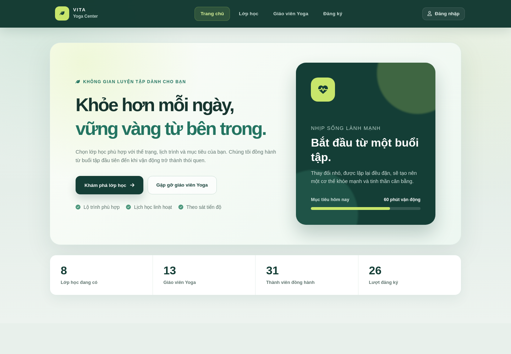
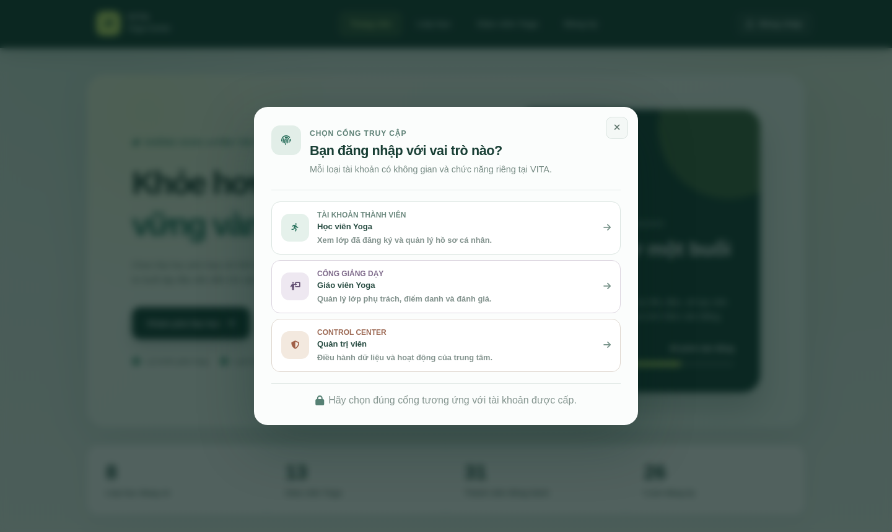
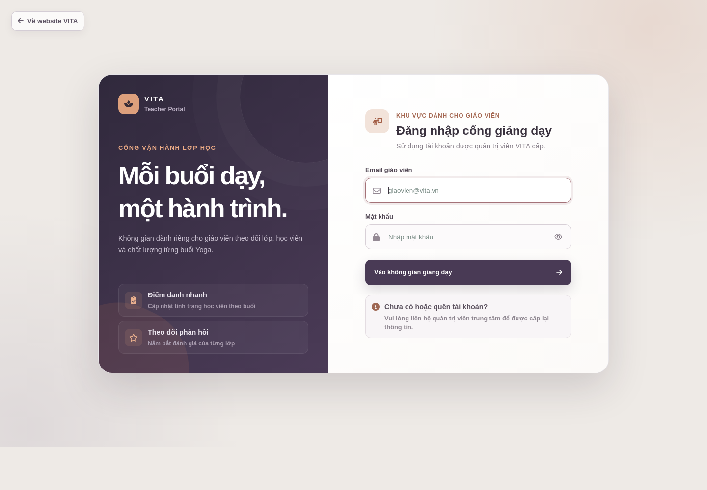
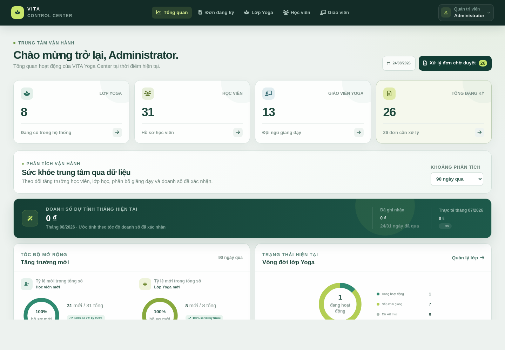

# VITA Yoga Center

Hệ thống đăng ký và quản lý trung tâm **Yoga** được xây dựng bằng Laravel. Dự án cung cấp ba không gian riêng cho học viên, giáo viên và quản trị viên; mỗi vai trò có giao diện, quyền truy cập và quy trình làm việc phù hợp.

> Giao diện hiện tại sử dụng nhận diện xanh rừng – xanh chanh, tập trung vào sức khỏe, khả năng đọc và trải nghiệm nhất quán trên toàn hệ thống. Những ảnh thiết kế cũ trong README đã được thay bằng ảnh chụp trực tiếp từ ứng dụng.

## Giao diện hiện tại

### Trang chủ và trải nghiệm học viên

Trang chủ mới làm rõ định vị Yoga, lớp đang mở, đội ngũ giáo viên và các lối tắt quan trọng. Các số liệu hiển thị được lấy từ cơ sở dữ liệu qua Eloquent, không phải dữ liệu viết cứng trong giao diện.

<p align="center">
  
</p>

### Một điểm đăng nhập, ba không gian sử dụng

Nút đăng nhập chung mở modal chọn đúng cổng truy cập. Học viên, giáo viên và quản trị viên vẫn có màn đăng nhập cùng dashboard riêng; middleware theo vai trò ngăn tài khoản truy cập sai khu vực.

<p align="center">
  
</p>

<table>
  <tr>
    <td width="50%"></td>
    <td width="50%"></td>
  </tr>
  <tr>
    <td align="center"><strong>Cổng giáo viên</strong></td>
    <td align="center"><strong>Control Center dành cho quản trị viên</strong></td>
  </tr>
</table>

### Dashboard quản trị

Dashboard tổng hợp dữ liệu vận hành từ database: học viên mới, lớp mới, lớp đang hoạt động, tỷ lệ đứng lớp của giáo viên và doanh số. Khu vực phân tích có bộ lọc thời gian; doanh số dự tính tháng hiện tại được so sánh với tháng trước.

<p align="center">
  
</p>

## Các phần đã hoàn thiện

### Học viên

- Trang chủ, danh sách và chi tiết lớp Yoga, danh sách và hồ sơ giáo viên.
- Đăng ký tài khoản, đăng nhập và đăng ký lớp theo `class_id`.
- Hồ sơ cá nhân có cập nhật thông tin và đổi mật khẩu; email đăng nhập không được phép thay đổi.
- Theo dõi lớp đã đăng ký, xem chi tiết, hủy đăng ký và gửi đánh giá.
- Card lớp nhấn mạnh khóa học, học phí, lịch học, khung giờ, địa điểm và trạng thái còn chỗ.

### Giáo viên

- Cổng đăng nhập riêng tại `/teacher/login` với nhận diện khác học viên và quản trị viên.
- Dashboard riêng tại `/teacher`, chỉ hiển thị lớp được phân công.
- Xem chi tiết lớp, danh sách đăng ký, điểm danh và đánh giá của học viên.

### Quản trị viên

- Control Center thống nhất header, typography, màu sắc, trạng thái focus và điều hướng.
- Dashboard thống kê cùng biểu đồ tròn, biểu đồ cột, bộ lọc khoảng thời gian và card doanh số dự tính.
- Quản lý đơn đăng ký: danh sách, tạo mới, chi tiết, chỉnh sửa, duyệt, từ chối và điểm danh.
- Quản lý lớp Yoga: danh sách, tạo, xem, sửa và xóa; lớp đủ chỗ có trạng thái màu riêng.
- Quản lý học viên và giáo viên: tìm kiếm, tạo, xem, sửa và xóa.
- Thông tin giáo viên trong form lớp có thêm dữ liệu nhận diện để tránh chọn nhầm người.
- Các thao tác xóa sử dụng modal xác nhận trước khi gửi yêu cầu; nút quay lại được tăng độ nhận biết.
- Email dùng để đăng nhập được khóa ở các luồng chỉnh sửa tài khoản.

## Phân quyền và điều hướng

| Vai trò | Cổng đăng nhập | Khu vực chính | Quyền tiêu biểu |
|---|---|---|---|
| Học viên | `/account/login` | `/account`, `/registered-classes` | Quản lý hồ sơ, đăng ký và đánh giá lớp |
| Giáo viên | `/teacher/login` | `/teacher` | Quản lý lớp phụ trách, điểm danh, xem đánh giá |
| Quản trị viên | `/admin/login` | `/admin/dashboard` | Điều hành lớp, đơn đăng ký, học viên, giáo viên và báo cáo |

Tài khoản quản trị truy cập route phía người dùng sẽ được chuyển về dashboard admin. Các route `/admin/*` và `/teacher/*` được bảo vệ bằng xác thực cùng middleware vai trò tương ứng.

## Công nghệ sử dụng

- PHP 8.2+, Laravel 12 và Laravel Sanctum.
- Blade, CSS responsive, Vanilla JavaScript và Font Awesome.
- MySQL, Eloquent ORM, migrations, factories và seeders.
- Vite 7, Tailwind CSS 4, Composer và NPM.

## Cài đặt và chạy dự án

Yêu cầu: PHP 8.2+, Composer, Node.js/NPM, MySQL và các PHP extension thông dụng của Laravel. Bộ test mặc định dùng SQLite in-memory nên môi trường chạy test cần thêm `pdo_sqlite`.

```bash
git clone <repository-url>
cd TTTN
composer install
npm install
cp .env.example .env
php artisan key:generate
```

Cập nhật kết nối database trong `.env`, sau đó khởi tạo dữ liệu và build frontend:

```bash
php artisan migrate --seed
php artisan storage:link
npm run build
php artisan serve
```

Truy cập [http://localhost:8000](http://localhost:8000). Khi phát triển giao diện, có thể chạy toàn bộ server, queue, log và Vite bằng:

```bash
composer run dev
```

Nếu gặp lỗi `Vite manifest not found`, hãy chạy `npm install && npm run build` hoặc giữ `npm run dev` hoạt động. Nếu Laravel báo cache path không hợp lệ, bảo đảm các thư mục runtime tồn tại và có quyền ghi:

```bash
mkdir -p storage/framework/cache/data storage/framework/sessions storage/framework/views bootstrap/cache
chmod -R ug+rwX storage bootstrap/cache
php artisan optimize:clear
```

### Tài khoản quản trị của dữ liệu seed

```text
Username: admin
Password: 123456
```

Thông tin này chỉ phục vụ môi trường phát triển; hãy đổi mật khẩu trước khi triển khai thực tế.

## API chính

- Public catalog: `GET /api/public/classes`, `GET /api/public/teachers`.
- Đăng ký lớp: `POST /api/registrations`.
- Hồ sơ học viên: `GET|PUT /api/account/profile`, `PUT /api/account/password`.
- Quản trị: API resource cho teachers, classes, customers và registrations.
- Vận hành lớp: attendance summary, attendance CRUD, review và teacher ranking.
- Dashboard admin: `GET /admin/dashboard/analytics` với bộ lọc khoảng thời gian.

Các API riêng tư sử dụng Sanctum và middleware vai trò.

### Code legacy và API chưa sử dụng

Một số Blade, controller và API cũ vẫn được giữ lại để tham khảo nhưng không thuộc luồng demo hiện tại. Danh sách, lý do và cảnh báo trước khi tái sử dụng được ghi tại [`docs/LEGACY_UNUSED.md`](docs/LEGACY_UNUSED.md).

## Kiểm thử

```bash
composer test
```

Bộ test hiện có bao gồm xác thực theo vai trò, lịch và đăng ký lớp, cập nhật hồ sơ/mật khẩu, điểm danh, đánh giá và cô lập route quản trị.

## Cấu trúc chính

```text
app/                 Controllers, Models, Requests, Middleware
database/            Migrations, Factories, Seeders
resources/views/     Blade templates theo từng vai trò
public/css/           Style cho giao diện học viên, giáo viên và admin
public/js/            Tương tác giao diện và dashboard analytics
routes/               Web routes và REST API
tests/                Feature tests
docs/screenshots/     Ảnh chụp giao diện hiện tại dùng trong README
```
